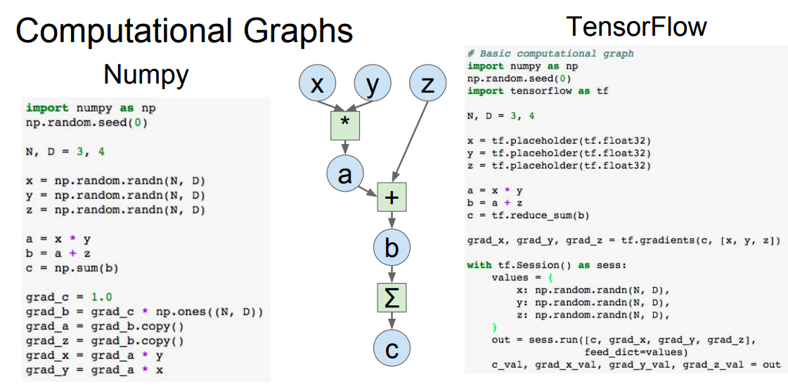

# Recap

## Graph

* 靜態的結構，定義的張量的流動，可以思考成設計圖

``` 
決定NN要怎麼連接
決定哪一些窗口是可以由外部來置放數據
哪一些變數可以被訓練
哪一些不可以被訓練
怎麼樣優化這個系統
```

* [from stanford computer vision, chp8 deep learning software](http://cs231n.stanford.edu/slides/2017/cs231n_2017_lecture8.pdf)

</img>
</img>
</img>

## Session

Session就像是web的session，可以執行一個計算任務，當然，你必須指定一個Graph讓他進行計算
有 `with` 寫法以及物件式寫法
 `with tf.Session(graph = my_graph) as sess:`

### with default
`tf.get_default_session()` : 獲得當前線程的session
`tf.Session().as_default()` : 指定該session為當前線程的session